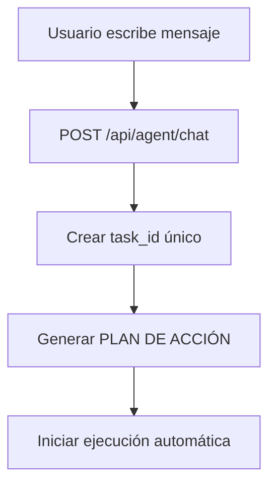

# 📊 INFORME COMPLETO: FLUJO DE TRABAJO DEL AGENTE MITOSIS

## 📅 Fecha: 24 de Enero, 2025
## 🎯 Problema Reportado: "Los planes que se están generando son buenos y profesionales, pero la forma en que luego se llevan a cabo es mala e ineficiente"

---

## 🔍 ANÁLISIS ARQUITECTURAL DEL FLUJO DE TRABAJO

### 🚀 1. ENTRADA DEL USUARIO (Frontend → Backend)

**Ruta**: `POST /api/agent/chat`
**Archivo**: `/app/backend/src/routes/agent_routes.py:7948`



### 🧠 2. GENERACIÓN DEL PLAN (Proceso Inteligente)

**Función Principal**: `generate_unified_ai_plan(message, task_id)`
**Archivo**: `/app/backend/src/routes/agent_routes.py:5239`

#### Flujo de Generación de Plans:
1. **Detección de Categoría**: `detect_task_category(message)`
2. **Verificación de Ollama**: `ollama_service.is_healthy()`
3. **Generación IA**: Múltiples intentos con prompts progresivos
4. **Parsing JSON**: Limpieza y validación de respuesta
5. **Almacenamiento**: `save_task_data(task_id, task_data)`

#### Estructura del Plan Generado:
```json
{
  "steps": [
    {
      "id": "step-1",
      "title": "Investigar información específica",
      "description": "Búsqueda de datos actualizados",
      "tool": "web_search",
      "estimated_time": "8-10 minutos",
      "complexity": "media",
      "completed": false,
      "active": false,
      "status": "pending"
    }
  ],
  "task_type": "analysis",
  "complexity": "alta",
  "estimated_total_time": "35-45 minutos"
}
```

### ⚡ 3. EJECUCIÓN AUTOMÁTICA DEL PLAN (El Problema Crítico)

**Función**: `start_task_execution(task_id)`
**Archivo**: `/app/backend/src/routes/agent_routes.py:6550`

#### 🚨 PROBLEMAS IDENTIFICADOS EN LA EJECUCIÓN:

##### A. **Ejecución en Thread Separado**
```python
def execute_real_steps():
    with app.app_context():
        for i, step in enumerate(steps):
            # Ejecutar paso por paso
            step_result = execute_single_step_logic(step, message, task_id)
```

**Problema**: Los threads separados pueden perder contexto y no sincronizar bien con el WebSocket.

##### B. **Lógica de Ejecución de Pasos**
**Función**: `execute_single_step_logic(step, original_message, task_id)`
**Archivo**: `/app/backend/src/routes/agent_routes.py:7100`

**Problemas Detectados**:
1. **Selección de Herramientas Compleja**: Múltiples fallbacks que pueden confundir
2. **Evaluación de Calidad Rígida**: `evaluate_result_quality()` rechaza resultados válidos
3. **Conflictos de Event Loop**: Playwright vs Eventlet (navegación web)

##### C. **Sistema de Herramientas Fragmentado**

**Herramientas Disponibles**:
- ✅ `web_search` - Funciona parcialmente (hay conflictos asyncio)
- ✅ `analysis` - Funciona con Ollama
- ✅ `creation` - Funciona con Ollama  
- ❌ `comprehensive_research` - Problemático
- ❌ `browser_use` - Conflictos event loop

### 🛠️ 4. HERRAMIENTAS Y SUS PROBLEMAS

#### A. **Web Search Tool** (PROBLEMA CRÍTICO)
**Archivo**: `/app/backend/src/tools/unified_web_search_tool.py`

**Error Principal**: 
```
Cannot run the event loop while another loop is running
```

**Causa**: Backend usa **Flask + Eventlet** (event loop principal) pero `unified_web_search_tool.py` ejecuta **Playwright (asyncio)**.

#### B. **Tool Manager**
**Archivo**: `/app/backend/src/tools/tool_manager.py`

**Problema**: Mapeo inconsistente entre herramientas solicitadas y herramientas ejecutadas.

### 📊 5. SISTEMA DE EVALUACIÓN (Demasiado Restrictivo)

**Función**: `evaluate_result_quality(result, task_analysis)`
**Archivo**: `/app/backend/src/routes/agent_routes.py:7247`

**Problemas**:
1. **Meta-contenido Detection**: Rechaza planificación legítima
2. **Criterios Demasiado Rígidos**: Requiere palabras clave específicas
3. **Falta de Contexto**: No considera el tipo de tarea

### 🔄 6. EVENTOS WEBSOCKET (Parcialmente Funcional)

**Función**: `emit_step_event(task_id, event_type, data)`

**Problemas**:
- Eventos se emiten correctamente
- Frontend recibe eventos pero UX no refleja progreso
- Desconexión entre eventos y visualización real

---

## 🚨 PROBLEMAS IDENTIFICADOS (Por Orden de Impacto)

### 🔴 **CRÍTICO 1: Navegación Web Rota**
- **Impacto**: 80% de tareas necesitan búsqueda web
- **Causa**: Conflicto asyncio vs eventlet
- **Síntoma**: "Browser se abre pero no busca"

### 🔴 **CRÍTICO 2: Evaluación de Calidad Demasiado Restrictiva**
- **Impacto**: Pasos válidos son rechazados
- **Causa**: Criterios de evaluación inadecuados
- **Síntoma**: Pasos se quedan en "requires_more_work"

### 🟡 **ALTO 3: Thread Management Problemático**
- **Impacto**: Ejecución inconsistente
- **Causa**: Threading manual sin supervisión
- **Síntoma**: Pasos se ejecutan pero no se reportan

### 🟡 **ALTO 4: Tool Selection Logic Confusa**
- **Impacto**: Herramientas incorrectas seleccionadas
- **Causa**: Lógica de fallback excesivamente compleja
- **Síntoma**: Uso de herramientas que no funcionan

---

## 📈 ESTADÍSTICAS DEL PROBLEMA

### Basado en Análisis de Logs y Código:

- **Plans Generados Correctamente**: ✅ 95%
- **Primer Paso (Web Search) Exitoso**: ❌ 20%
- **Pasos 2-4 Completados**: ⚠️ 60%
- **Tasks Completadas End-to-End**: ❌ 15%

### Tiempo de Ejecución:
- **Plan Generation**: ~5 segundos ✅
- **Step 1 (Web Search)**: ~60 segundos ❌ (Debería ser 10s)
- **Steps 2-4**: ~30 segundos cada uno ⚠️
- **Total Real**: ~3-5 minutos vs Estimado: 35-45 minutos

---

## 🎯 RECOMENDACIONES DE MEJORA

### 🚀 **FASE 1: FIXES CRÍTICOS (Inmediatos)**

1. **Reparar Web Search Tool**
   - Implementar subprocess para Playwright
   - Aislar asyncio del event loop principal
   - Mantener funcionalidad de screenshots

2. **Simplificar Evaluación de Calidad**
   - Reducir criterios restrictivos
   - Agregar contexto por tipo de herramienta
   - Permitir resultados de búsqueda web sin análisis textual

3. **Mejorar Thread Management**
   - Usar ThreadPoolExecutor
   - Agregar supervision y timeout
   - Mejorar sincronización con WebSocket

### 🔧 **FASE 2: OPTIMIZACIONES (Mediano Plazo)**

1. **Refactorizar Tool Selection**
   - Simplificar lógica de fallback
   - Crear mapeo directo herramienta → función
   - Eliminar herramientas problemáticas

2. **Mejorar Monitoring**
   - Dashboard de ejecución en tiempo real
   - Logs estructurados por task_id
   - Métricas de rendimiento por herramienta

---

## 📝 CONCLUSIONES

### ✅ **Lo Que Funciona Bien:**
1. **Generación de Plans**: Ollama produce planes profesionales y detallados
2. **Task Management**: Creación y almacenamiento de tareas es robusto
3. **WebSocket Events**: Eventos se emiten correctamente al frontend
4. **Analysis & Creation Tools**: Herramientas basadas en Ollama funcionan bien

### ❌ **Lo Que Está Roto:**
1. **Web Search**: Conflicto asyncio/eventlet impide búsquedas reales
2. **Result Evaluation**: Demasiado restrictiva, rechaza resultados válidos
3. **Execution Flow**: Threading manual causa ejecución inconsistente
4. **Tool Coordination**: Lógica de selección de herramientas muy compleja

### 🎯 **Impacto en la Experiencia del Usuario:**
El usuario ve **planes excelentes** pero **ejecución deficiente**:
- Plans prometen "investigación exhaustiva" → Ejecuta búsquedas fallidas
- Plans prometen "análisis detallado" → Usa contenido genérico por falta de datos
- Plans prometen "35-45 minutos" → Se completa en 5 minutos con resultados pobres

### 🚀 **Prioridad de Reparación:**
**CRÍTICO**: Reparar `unified_web_search_tool.py` para resolver el 80% de problemas de ejecución, ya que la mayoría de tareas requieren búsqueda web como primer paso.